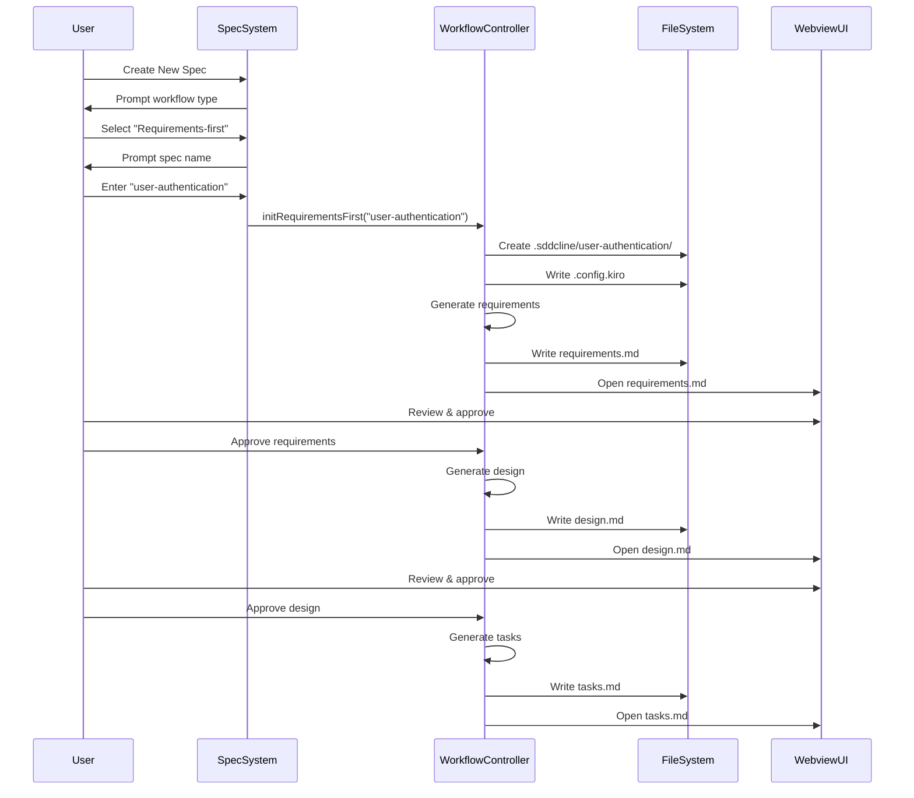
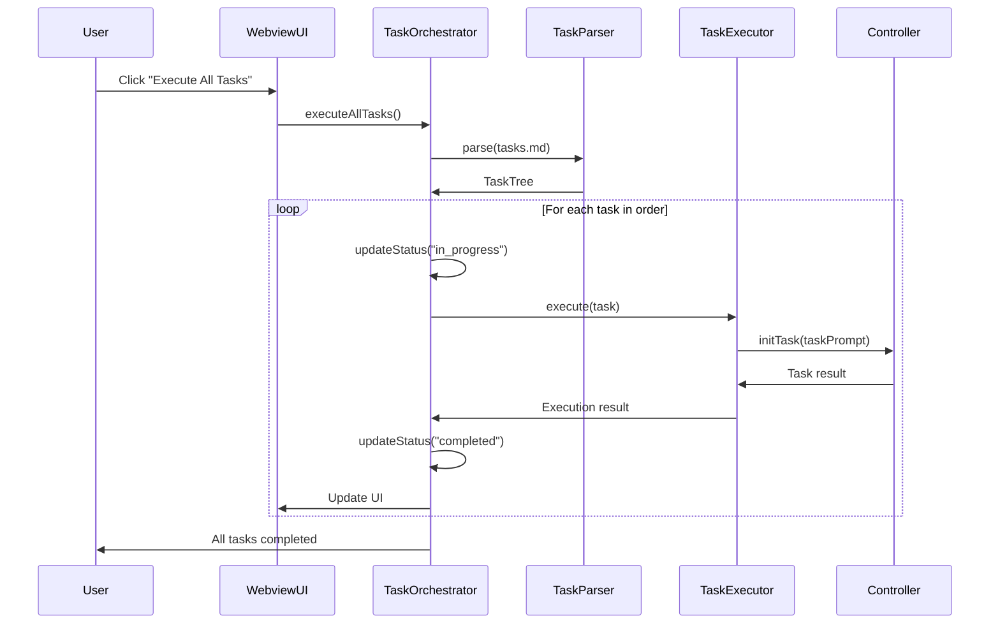

# Design Document: SDD Cline Spec Workflow

## Overview

The Spec Workflow system integrates Kiro's specification management capabilities into Cline, enabling structured software development through requirements, design, and task documents. The system supports two workflow paths (requirements-first and design-first) with an interactive preview UI and automated task execution.

### Goals

- Provide structured approach to feature development with requirements → design → tasks flow
- Enable interactive preview and management of spec documents through VSCode webview
- Automate task execution with intelligent orchestration and status tracking
- Integrate seamlessly with existing Cline architecture and patterns
- Support property-based testing workflow for correctness verification

### Non-Goals

- Replace existing Cline chat-based workflow (complementary, not replacement)
- Provide project-wide dependency management across multiple specs
- Support real-time collaboration between multiple users
- Implement version control beyond basic file tracking

## Architecture

### High-Level Architecture

```mermaid
graph TB
    subgraph "VSCode Extension"
        CMD[Command Palette]
        EXPLORER[File Explorer]
    end
    
    subgraph "Spec System Core"
        SPEC_SYS[SpecSystem]
        WF_CTRL[WorkflowController]
        TASK_ORCH[TaskOrchestrator]
    end
    
    subgraph "UI Layer"
        PREVIEW[SpecPreviewProvider]
        WEBVIEW[Webview UI]
    end
    
    subgraph "Data Layer"
        REQ_PARSER[RequirementsParser]
        TASK_PARSER[TasksParser]
        CONFIG[ConfigManager]
    end
    
    subgraph "Execution Layer"
        TASK_EXEC[TaskExecutor]
        CONTROLLER[Cline Controller]
    end
    
    subgraph "File System"
        SPEC_DIR[.sddcline/{spec-name}/]
        REQ_FILE[requirements.md]
        DESIGN_FILE[design.md]
        TASKS_FILE[tasks.md]
        CONFIG_FILE[.config.kiro]
    end
    
    CMD --> SPEC_SYS
    EXPLORER --> PREVIEW
    
    SPEC_SYS --> WF_CTRL
    SPEC_SYS --> CONFIG
    
    WF_CTRL --> REQ_PARSER
    WF_CTRL --> TASK_PARSER
    WF_CTRL --> SPEC_DIR
    
    PREVIEW --> WEBVIEW
    WEBVIEW --> TASK_ORCH
    
    TASK_ORCH --> TASK_PARSER
    TASK_ORCH --> TASK_EXEC
    
    TASK_EXEC --> CONTROLLER
    
    SPEC_DIR --> REQ_FILE
    SPEC_DIR --> DESIGN_FILE
    SPEC_DIR --> TASKS_FILE
    SPEC_DIR --> CONFIG_FILE
```

### Component Interaction Flow

#### Spec Creation Flow (Requirements-First)



#### Task Execution Flow



## Components and Interfaces

### 1. SpecSystem

Entry point and coordinator for all spec operations.

```typescript
export class SpecSystem {
    private workflowController: WorkflowController
    private configManager: ConfigManager
    private previewProvider: SpecPreviewProvider
    
    constructor(context: vscode.ExtensionContext) {
        this.workflowController = new WorkflowController(context)
        this.configManager = new ConfigManager()
        this.previewProvider = new SpecPreviewProvider(context)
    }
    
    /**
     * Create a new spec with user interaction
     */
    async createNewSpec(): Promise<void> {
        // Prompt for workflow type
        const workflowType = await this.promptWorkflowType()
        
        // Prompt for spec name
        const specName = await this.promptSpecName()
        
        // Validate spec name (kebab-case)
        if (!this.validateSpecName(specName)) {
            throw new Error("Invalid spec name. Use kebab-case format.")
        }
        
        // Check if spec already exists
        if (await this.specExists(specName)) {
            throw new Error(`Spec "${specName}" already exists.`)
        }
        
        // Initialize workflow
        if (workflowType === "requirements-first") {
            await this.workflowController.initRequirementsFirst(specName)
        } else {
            await this.workflowController.initDesignFirst(specName)
        }
    }
    
    /**
     * Open spec preview for a given spec file
     */
    async openSpecPreview(filePath: string): Promise<void> {
        const specName = this.extractSpecName(filePath)
        await this.previewProvider.show(specName)
    }
    
    private validateSpecName(name: string): boolean {
        return /^[a-z0-9]+(-[a-z0-9]+)*$/.test(name)
    }
    
    private async specExists(specName: string): Promise<boolean> {
        const specPath = path.join(
            vscode.workspace.workspaceFolders![0].uri.fsPath,
            ".sddcline",
            specName
        )
        return fs.existsSync(specPath)
    }
}
```

### 2. WorkflowController

Manages workflow logic and document generation.

```typescript
export class WorkflowController {
    private context: vscode.ExtensionContext
    private controller: Controller
    private requirementsParser: RequirementsParser
    private tasksParser: TasksParser
    
    constructor(context: vscode.ExtensionContext) {
        this.context = context
        this.controller = new Controller(context)
        this.requirementsParser = new RequirementsParser()
        this.tasksParser = new TasksParser()
    }
    
    /**
     * Initialize requirements-first workflow
     */
    async initRequirementsFirst(specName: string): Promise<void> {
        // Create spec directory structure
        const specDir = await this.createSpecDirectory(specName)
        
        // Create config file
        await this.createConfigFile(specDir, {
            specId: uuidv4(),
            workflowType: "requirements-first",
            specType: "feature",
            createdAt: new Date().toISOString()
        })
        
        // Generate requirements document
        await this.generateRequirements(specDir, specName)
        
        // Open requirements for review
        await this.openDocument(path.join(specDir, "requirements.md"))
        
        // Wait for user approval
        await this.waitForApproval("requirements")
        
        // Generate design document
        await this.generateDesign(specDir, specName)
        
        // Open design for review
        await this.openDocument(path.join(specDir, "design.md"))
        
        // Wait for user approval
        await this.waitForApproval("design")
        
        // Generate tasks document
        await this.generateTasks(specDir, specName)
        
        // Open tasks for review
        await this.openDocument(path.join(specDir, "tasks.md"))
    }
    
    /**
     * Initialize design-first workflow
     */
    async initDesignFirst(specName: string): Promise<void> {
        // Similar to initRequirementsFirst but starts with design
        const specDir = await this.createSpecDirectory(specName)
        
        await this.createConfigFile(specDir, {
            specId: uuidv4(),
            workflowType: "design-first",
            specType: "feature",
            createdAt: new Date().toISOString()
        })
        
        await this.generateDesign(specDir, specName)
        await this.openDocument(path.join(specDir, "design.md"))
        await this.waitForApproval("design")
        
        await this.generateTasks(specDir, specName)
        await this.openDocument(path.join(specDir, "tasks.md"))
    }
    
    private async createSpecDirectory(specName: string): Promise<string> {
        const workspaceRoot = vscode.workspace.workspaceFolders![0].uri.fsPath
        const specDir = path.join(workspaceRoot, ".sddcline", specName)
        
        await fs.promises.mkdir(specDir, { recursive: true })
        
        return specDir
    }
    
    private async generateRequirements(specDir: string, specName: string): Promise<void> {
        // Use Cline's controller to generate requirements
        const prompt = `Generate requirements document for feature: ${specName}`
        await this.controller.initTask({
            task: prompt,
            mode: "plan"
        })
        
        // Save generated content to requirements.md
        // (Implementation details depend on how we extract content from controller)
    }
    
    private async waitForApproval(documentType: string): Promise<void> {
        // Show notification with approve/modify buttons
        const result = await vscode.window.showInformationMessage(
            `Review ${documentType} document`,
            "Approve",
            "Modify"
        )
        
        if (result === "Modify") {
            // Wait for user to make changes and approve again
            await this.waitForApproval(documentType)
        }
    }
}
```


### 3. TaskOrchestrator

Coordinates task execution with dependency management.

```typescript
export class TaskOrchestrator {
    private tasksParser: TasksParser
    private taskExecutor: TaskExecutor
    private currentExecution: TaskExecution | null = null
    
    constructor(
        private specDir: string,
        private controller: Controller
    ) {
        this.tasksParser = new TasksParser()
        this.taskExecutor = new TaskExecutor(controller)
    }
    
    /**
     * Execute all tasks in order
     */
    async executeAllTasks(): Promise<void> {
        const tasksFile = path.join(this.specDir, "tasks.md")
        const taskTree = await this.tasksParser.parse(tasksFile)
        
        this.currentExecution = {
            startTime: Date.now(),
            tasks: taskTree.getAllTasks(),
            completed: [],
            failed: []
        }
        
        for (const task of taskTree.getAllTasks()) {
            await this.executeTask(task)
        }
    }
    
    /**
     * Execute a single task
     */
    async executeTask(task: Task): Promise<void> {
        // Update status to in_progress
        await this.updateTaskStatus(task.id, "in_progress")
        
        try {
            // If task has sub-tasks, execute them first
            if (task.subTasks && task.subTasks.length > 0) {
                for (const subTask of task.subTasks) {
                    await this.executeTask(subTask)
                }
            }
            
            // Execute the task
            const result = await this.taskExecutor.execute(task)
            
            // Update status to completed
            await this.updateTaskStatus(task.id, "completed")
            
            this.currentExecution?.completed.push(task.id)
            
        } catch (error) {
            // Update status to failed
            await this.updateTaskStatus(task.id, "failed")
            
            this.currentExecution?.failed.push({
                taskId: task.id,
                error: error.message
            })
            
            throw error
        }
    }
    
    /**
     * Update task status in tasks.md file
     */
    private async updateTaskStatus(
        taskId: string,
        status: TaskStatus
    ): Promise<void> {
        const tasksFile = path.join(this.specDir, "tasks.md")
        const content = await fs.promises.readFile(tasksFile, "utf-8")
        
        // Parse tasks
        const taskTree = await this.tasksParser.parse(tasksFile)
        
        // Find and update task
        const task = taskTree.findTask(taskId)
        if (task) {
            task.status = status
        }
        
        // Pretty print back to file
        const updatedContent = this.tasksParser.prettyPrint(taskTree)
        await fs.promises.writeFile(tasksFile, updatedContent)
        
        // Notify UI
        this.notifyStatusChange(taskId, status)
    }
    
    private notifyStatusChange(taskId: string, status: TaskStatus): void {
        // Send message to webview
        vscode.commands.executeCommand(
            "sddcline.updateTaskStatus",
            { taskId, status }
        )
    }
}
```

### 4. SpecPreviewProvider

Webview provider for spec document preview.

```typescript
export class SpecPreviewProvider implements vscode.WebviewViewProvider {
    private view?: vscode.WebviewView
    private currentSpecName?: string
    private currentTab: "requirements" | "design" | "tasks" = "requirements"
    
    constructor(private context: vscode.ExtensionContext) {}
    
    resolveWebviewView(
        webviewView: vscode.WebviewView,
        context: vscode.WebviewViewResolveContext,
        token: vscode.CancellationToken
    ): void | Thenable<void> {
        this.view = webviewView
        
        webviewView.webview.options = {
            enableScripts: true,
            localResourceRoots: [this.context.extensionUri]
        }
        
        webviewView.webview.html = this.getHtmlContent()
        
        // Handle messages from webview
        webviewView.webview.onDidReceiveMessage(async (message) => {
            switch (message.type) {
                case "switchTab":
                    await this.switchTab(message.tab)
                    break
                case "executeTask":
                    await this.executeTask(message.taskId)
                    break
                case "executeAllTasks":
                    await this.executeAllTasks()
                    break
            }
        })
    }
    
    async show(specName: string): Promise<void> {
        this.currentSpecName = specName
        await this.loadSpecContent()
    }
    
    private async loadSpecContent(): Promise<void> {
        if (!this.currentSpecName) return
        
        const workspaceRoot = vscode.workspace.workspaceFolders![0].uri.fsPath
        const specDir = path.join(workspaceRoot, ".sddcline", this.currentSpecName)
        
        const requirements = await this.readFile(path.join(specDir, "requirements.md"))
        const design = await this.readFile(path.join(specDir, "design.md"))
        const tasks = await this.readFile(path.join(specDir, "tasks.md"))
        
        this.view?.webview.postMessage({
            type: "loadContent",
            content: { requirements, design, tasks }
        })
    }
    
    private async switchTab(tab: string): Promise<void> {
        this.currentTab = tab as any
        this.view?.webview.postMessage({
            type: "switchTab",
            tab
        })
    }
    
    private async executeTask(taskId: string): Promise<void> {
        if (!this.currentSpecName) return
        
        const workspaceRoot = vscode.workspace.workspaceFolders![0].uri.fsPath
        const specDir = path.join(workspaceRoot, ".sddcline", this.currentSpecName)
        
        const orchestrator = new TaskOrchestrator(
            specDir,
            WebviewProvider.getInstance().controller
        )
        
        const tasksFile = path.join(specDir, "tasks.md")
        const taskTree = await new TasksParser().parse(tasksFile)
        const task = taskTree.findTask(taskId)
        
        if (task) {
            await orchestrator.executeTask(task)
        }
    }
    
    private async executeAllTasks(): Promise<void> {
        if (!this.currentSpecName) return
        
        const workspaceRoot = vscode.workspace.workspaceFolders![0].uri.fsPath
        const specDir = path.join(workspaceRoot, ".sddcline", this.currentSpecName)
        
        const orchestrator = new TaskOrchestrator(
            specDir,
            WebviewProvider.getInstance().controller
        )
        
        await orchestrator.executeAllTasks()
    }
    
    private getHtmlContent(): string {
        return `
            <!DOCTYPE html>
            <html>
            <head>
                <meta charset="UTF-8">
                <style>
                    body { 
                        font-family: var(--vscode-font-family);
                        padding: 0;
                        margin: 0;
                    }
                    .tabs {
                        display: flex;
                        border-bottom: 1px solid var(--vscode-panel-border);
                        background: var(--vscode-editor-background);
                    }
                    .tab {
                        padding: 10px 20px;
                        cursor: pointer;
                        border: none;
                        background: transparent;
                        color: var(--vscode-foreground);
                    }
                    .tab.active {
                        border-bottom: 2px solid var(--vscode-focusBorder);
                    }
                    .content {
                        padding: 20px;
                        overflow-y: auto;
                        height: calc(100vh - 50px);
                    }
                    .task-item {
                        display: flex;
                        align-items: center;
                        margin: 5px 0;
                    }
                    .task-button {
                        margin-left: 10px;
                        padding: 2px 8px;
                        font-size: 12px;
                    }
                    .execute-all {
                        margin: 10px 0;
                        padding: 8px 16px;
                    }
                </style>
            </head>
            <body>
                <div class="tabs">
                    <button class="tab active" data-tab="requirements">Requirements</button>
                    <button class="tab" data-tab="design">Design</button>
                    <button class="tab" data-tab="tasks">Tasks</button>
                </div>
                <div class="content" id="content"></div>
                
                <script>
                    const vscode = acquireVsCodeApi();
                    
                    // Tab switching
                    document.querySelectorAll('.tab').forEach(tab => {
                        tab.addEventListener('click', () => {
                            const tabName = tab.dataset.tab;
                            vscode.postMessage({ type: 'switchTab', tab: tabName });
                        });
                    });
                    
                    // Handle messages from extension
                    window.addEventListener('message', event => {
                        const message = event.data;
                        switch (message.type) {
                            case 'loadContent':
                                loadContent(message.content);
                                break;
                            case 'switchTab':
                                switchTab(message.tab);
                                break;
                            case 'updateTaskStatus':
                                updateTaskStatus(message.taskId, message.status);
                                break;
                        }
                    });
                    
                    function loadContent(content) {
                        // Store content
                        window.specContent = content;
                        // Display current tab
                        switchTab('requirements');
                    }
                    
                    function switchTab(tab) {
                        // Update active tab
                        document.querySelectorAll('.tab').forEach(t => {
                            t.classList.toggle('active', t.dataset.tab === tab);
                        });
                        
                        // Render content
                        const contentDiv = document.getElementById('content');
                        const content = window.specContent[tab];
                        
                        if (tab === 'tasks') {
                            contentDiv.innerHTML = renderTasks(content);
                        } else {
                            contentDiv.innerHTML = marked.parse(content);
                        }
                    }
                    
                    function renderTasks(markdown) {
                        // Add execute buttons to tasks
                        let html = '<button class="execute-all" onclick="executeAllTasks()">Execute All Tasks</button>';
                        html += marked.parse(markdown);
                        
                        // Add execute buttons to each task
                        // (Simplified - actual implementation would parse task structure)
                        return html;
                    }
                    
                    function executeAllTasks() {
                        vscode.postMessage({ type: 'executeAllTasks' });
                    }
                    
                    function executeTask(taskId) {
                        vscode.postMessage({ type: 'executeTask', taskId });
                    }
                    
                    function updateTaskStatus(taskId, status) {
                        // Update checkbox in UI
                        const statusMap = {
                            'not_started': '[ ]',
                            'queued': '[~]',
                            'in_progress': '[~]',
                            'completed': '[x]'
                        };
                        // Update DOM
                    }
                </script>
            </body>
            </html>
        `
    }
}
```

### 5. TaskExecutor

Executes individual tasks using Cline's controller.

```typescript
export class TaskExecutor {
    constructor(private controller: Controller) {}
    
    /**
     * Execute a single task
     */
    async execute(task: Task): Promise<TaskResult> {
        // Create task prompt from task description
        const prompt = this.createTaskPrompt(task)
        
        // Initialize Cline task
        await this.controller.initTask({
            task: prompt,
            mode: "act" // Use act mode for implementation
        })
        
        // Wait for task completion
        const result = await this.waitForTaskCompletion()
        
        return {
            taskId: task.id,
            success: result.success,
            output: result.output,
            error: result.error
        }
    }
    
    private createTaskPrompt(task: Task): string {
        return `
Task: ${task.description}

Context:
- Task ID: ${task.id}
- Parent Task: ${task.parentId || "None"}

Please implement this task according to the design document.
        `.trim()
    }
    
    private async waitForTaskCompletion(): Promise<{
        success: boolean
        output: string
        error?: string
    }> {
        // Monitor controller task state
        // Return when task completes or fails
        return new Promise((resolve) => {
            const checkInterval = setInterval(() => {
                const task = this.controller.task
                if (!task || task.state === "completed") {
                    clearInterval(checkInterval)
                    resolve({
                        success: true,
                        output: "Task completed"
                    })
                } else if (task.state === "failed") {
                    clearInterval(checkInterval)
                    resolve({
                        success: false,
                        output: "",
                        error: "Task failed"
                    })
                }
            }, 1000)
        })
    }
}
```

### 6. RequirementsParser

Parses requirements documents into structured objects.

```typescript
export interface Requirement {
    id: string // e.g., "1", "1.1"
    userStory: string
    acceptanceCriteria: AcceptanceCriterion[]
}

export interface AcceptanceCriterion {
    id: string // e.g., "1.1", "1.2"
    text: string
    earsPattern: EARSPattern
}

export enum EARSPattern {
    UBIQUITOUS = "ubiquitous",
    EVENT_DRIVEN = "event-driven",
    STATE_DRIVEN = "state-driven",
    OPTIONAL = "optional",
    UNWANTED = "unwanted",
    COMPLEX = "complex"
}

export class RequirementsParser {
    /**
     * Parse requirements document into structured objects
     */
    parse(content: string): Requirement[] {
        const requirements: Requirement[] = []
        const lines = content.split("\n")
        
        let currentRequirement: Requirement | null = null
        let currentCriteria: AcceptanceCriterion[] = []
        
        for (let i = 0; i < lines.length; i++) {
            const line = lines[i]
            
            // Match requirement header: ### Requirement N
            const reqMatch = line.match(/^###\s+Requirement\s+(\d+)/)
            if (reqMatch) {
                // Save previous requirement
                if (currentRequirement) {
                    currentRequirement.acceptanceCriteria = currentCriteria
                    requirements.push(currentRequirement)
                }
                
                // Start new requirement
                currentRequirement = {
                    id: reqMatch[1],
                    userStory: "",
                    acceptanceCriteria: []
                }
                currentCriteria = []
                continue
            }
            
            // Match user story
            const storyMatch = line.match(/^\*\*User Story:\*\*\s+(.+)/)
            if (storyMatch && currentRequirement) {
                currentRequirement.userStory = storyMatch[1]
                continue
            }
            
            // Match acceptance criteria
            const criteriaMatch = line.match(/^(\d+)\.\s+(.+)/)
            if (criteriaMatch && currentRequirement) {
                const criterion: AcceptanceCriterion = {
                    id: `${currentRequirement.id}.${criteriaMatch[1]}`,
                    text: criteriaMatch[2],
                    earsPattern: this.detectEARSPattern(criteriaMatch[2])
                }
                currentCriteria.push(criterion)
            }
        }
        
        // Save last requirement
        if (currentRequirement) {
            currentRequirement.acceptanceCriteria = currentCriteria
            requirements.push(currentRequirement)
        }
        
        return requirements
    }
    
    /**
     * Pretty print requirements back to markdown
     */
    prettyPrint(requirements: Requirement[]): string {
        let output = "# Requirements Document\n\n"
        
        for (const req of requirements) {
            output += `### Requirement ${req.id}\n\n`
            output += `**User Story:** ${req.userStory}\n\n`
            output += `#### Acceptance Criteria\n\n`
            
            for (let i = 0; i < req.acceptanceCriteria.length; i++) {
                const criterion = req.acceptanceCriteria[i]
                output += `${i + 1}. ${criterion.text}\n`
            }
            
            output += "\n"
        }
        
        return output
    }
    
    private detectEARSPattern(text: string): EARSPattern {
        if (text.includes("WHEN") && text.includes("THEN")) {
            return EARSPattern.EVENT_DRIVEN
        } else if (text.includes("WHILE") && text.includes("SHALL")) {
            return EARSPattern.STATE_DRIVEN
        } else if (text.includes("WHERE") && text.includes("SHALL")) {
            return EARSPattern.OPTIONAL
        } else if (text.includes("IF") && text.includes("THEN")) {
            return EARSPattern.UNWANTED
        } else if (text.startsWith("THE")) {
            return EARSPattern.UBIQUITOUS
        } else {
            return EARSPattern.COMPLEX
        }
    }
}
```


### 7. TasksParser

Parses tasks documents with hierarchy support.

```typescript
export interface Task {
    id: string // e.g., "1", "1.1", "1.1.1"
    description: string
    status: TaskStatus
    indentLevel: number
    parentId?: string
    subTasks: Task[]
    pbtStatus?: PBTStatus
}

export enum TaskStatus {
    NOT_STARTED = "not_started",
    QUEUED = "queued",
    IN_PROGRESS = "in_progress",
    COMPLETED = "completed",
    FAILED = "failed"
}

export interface PBTStatus {
    status: "passed" | "failed" | "not_run" | "unexpected_pass"
    failingExample?: string
}

export class TaskTree {
    constructor(public tasks: Task[]) {}
    
    /**
     * Get all tasks in depth-first order
     */
    getAllTasks(): Task[] {
        const result: Task[] = []
        
        const traverse = (tasks: Task[]) => {
            for (const task of tasks) {
                result.push(task)
                if (task.subTasks.length > 0) {
                    traverse(task.subTasks)
                }
            }
        }
        
        traverse(this.tasks)
        return result
    }
    
    /**
     * Find task by ID
     */
    findTask(taskId: string): Task | undefined {
        const search = (tasks: Task[]): Task | undefined => {
            for (const task of tasks) {
                if (task.id === taskId) {
                    return task
                }
                if (task.subTasks.length > 0) {
                    const found = search(task.subTasks)
                    if (found) return found
                }
            }
            return undefined
        }
        
        return search(this.tasks)
    }
}

export class TasksParser {
    /**
     * Parse tasks document into task tree
     */
    async parse(filePath: string): Promise<TaskTree> {
        const content = await fs.promises.readFile(filePath, "utf-8")
        const lines = content.split("\n")
        
        const tasks: Task[] = []
        const taskStack: Task[] = []
        
        for (const line of lines) {
            // Match task line: - [status] taskId description
            const match = line.match(/^(\s*)- \[(.)\] ([\d.]+) (.+)$/)
            if (!match) continue
            
            const [, indent, statusChar, taskId, description] = match
            const indentLevel = indent.length / 2 // Assuming 2 spaces per level
            
            const task: Task = {
                id: taskId,
                description: description.trim(),
                status: this.parseStatus(statusChar),
                indentLevel,
                subTasks: []
            }
            
            // Determine parent based on indent level
            while (taskStack.length > 0 && taskStack[taskStack.length - 1].indentLevel >= indentLevel) {
                taskStack.pop()
            }
            
            if (taskStack.length > 0) {
                const parent = taskStack[taskStack.length - 1]
                task.parentId = parent.id
                parent.subTasks.push(task)
            } else {
                tasks.push(task)
            }
            
            taskStack.push(task)
        }
        
        return new TaskTree(tasks)
    }
    
    /**
     * Pretty print task tree back to markdown
     */
    prettyPrint(taskTree: TaskTree): string {
        let output = "# Tasks\n\n"
        
        const printTask = (task: Task, indent: number = 0) => {
            const indentStr = "  ".repeat(indent)
            const statusChar = this.formatStatus(task.status)
            output += `${indentStr}- [${statusChar}] ${task.id} ${task.description}\n`
            
            for (const subTask of task.subTasks) {
                printTask(subTask, indent + 1)
            }
        }
        
        for (const task of taskTree.tasks) {
            printTask(task)
        }
        
        return output
    }
    
    private parseStatus(char: string): TaskStatus {
        switch (char) {
            case " ": return TaskStatus.NOT_STARTED
            case "~": return TaskStatus.IN_PROGRESS
            case "x": return TaskStatus.COMPLETED
            case "-": return TaskStatus.FAILED
            default: return TaskStatus.NOT_STARTED
        }
    }
    
    private formatStatus(status: TaskStatus): string {
        switch (status) {
            case TaskStatus.NOT_STARTED: return " "
            case TaskStatus.QUEUED: return "~"
            case TaskStatus.IN_PROGRESS: return "~"
            case TaskStatus.COMPLETED: return "x"
            case TaskStatus.FAILED: return "-"
        }
    }
}
```

### 8. ConfigManager

Manages spec configuration files.

```typescript
export interface SpecConfig {
    specId: string
    workflowType: "requirements-first" | "design-first"
    specType: "feature" | "bugfix" | "refactor"
    createdAt: string
    lastModified?: string
}

export class ConfigManager {
    /**
     * Create config file for new spec
     */
    async createConfig(specDir: string, config: SpecConfig): Promise<void> {
        const configPath = path.join(specDir, ".config.kiro")
        const content = JSON.stringify(config, null, 2)
        await fs.promises.writeFile(configPath, content)
    }
    
    /**
     * Load config from spec directory
     */
    async loadConfig(specDir: string): Promise<SpecConfig> {
        const configPath = path.join(specDir, ".config.kiro")
        
        try {
            const content = await fs.promises.readFile(configPath, "utf-8")
            return JSON.parse(content)
        } catch (error) {
            throw new Error(`Failed to load config: ${error.message}`)
        }
    }
    
    /**
     * Update config file
     */
    async updateConfig(specDir: string, updates: Partial<SpecConfig>): Promise<void> {
        const config = await this.loadConfig(specDir)
        const updatedConfig = {
            ...config,
            ...updates,
            lastModified: new Date().toISOString()
        }
        await this.createConfig(specDir, updatedConfig)
    }
    
    /**
     * Validate config format
     */
    validateConfig(config: any): boolean {
        return (
            typeof config.specId === "string" &&
            ["requirements-first", "design-first"].includes(config.workflowType) &&
            ["feature", "bugfix", "refactor"].includes(config.specType) &&
            typeof config.createdAt === "string"
        )
    }
}
```

## Data Models

### Spec Directory Structure

```
.sddcline/
└── {spec-name}/
    ├── .config.kiro          # Spec metadata
    ├── requirements.md       # Requirements document
    ├── design.md            # Design document
    └── tasks.md             # Tasks document
```

### Config File Format

```json
{
  "specId": "130b4bea-e165-40db-ab93-00c0fdc3c0e1",
  "workflowType": "requirements-first",
  "specType": "feature",
  "createdAt": "2024-01-15T10:30:00Z",
  "lastModified": "2024-01-15T14:20:00Z"
}
```

### Requirements Document Structure

```markdown
# Requirements Document

## Introduction
[Feature overview and context]

## Glossary
- **Term**: Definition

## Requirements

### Requirement 1: [Title]

**User Story:** As a [role], I want [goal], so that [benefit].

#### Acceptance Criteria

1. WHEN [event] THEN THE system SHALL [action]
2. THE system SHALL [action] [condition]
3. WHILE [state] THE system SHALL [action]

### Requirement 2: [Title]
...
```

### Design Document Structure

```markdown
# Design Document

## Overview
[High-level design overview]

## Architecture
[Architecture diagrams and descriptions]

## Components and Interfaces
[Detailed component designs with code examples]

## Data Models
[Data structures and schemas]

## Correctness Properties
[Property-based testing properties]

## Error Handling
[Error handling strategies]

## Testing Strategy
[Testing approach and requirements]
```

### Tasks Document Structure

```markdown
# Tasks

## Phase 1: Setup

- [ ] 1 Setup project structure
  - [ ] 1.1 Create directory structure
  - [ ] 1.2 Initialize configuration

## Phase 2: Implementation

- [ ] 2 Implement core features
  - [ ] 2.1 Implement parser
    - [ ] 2.1.1 Write unit tests
    - [ ] 2.1.2 Implement parsing logic
  - [ ] 2.2 Implement pretty printer

## Phase 3: Testing

- [ ] 3 Write tests
  - [ ] 3.1 Unit tests
  - [ ] 3.2 Integration tests
```

### Task Status Markers

- `[ ]` - not_started
- `[~]` - in_progress or queued
- `[x]` - completed
- `[-]` - failed

### Internal Data Structures

```typescript
// Task execution state
interface TaskExecution {
    startTime: number
    tasks: Task[]
    completed: string[]
    failed: Array<{
        taskId: string
        error: string
    }>
}

// Task result
interface TaskResult {
    taskId: string
    success: boolean
    output: string
    error?: string
}

// Webview message types
type WebviewMessage =
    | { type: "switchTab"; tab: string }
    | { type: "executeTask"; taskId: string }
    | { type: "executeAllTasks" }
    | { type: "loadContent"; content: SpecContent }
    | { type: "updateTaskStatus"; taskId: string; status: TaskStatus }

interface SpecContent {
    requirements: string
    design: string
    tasks: string
}
```

## API Design

### Public APIs

```typescript
// Extension activation
export function activate(context: vscode.ExtensionContext) {
    const specSystem = new SpecSystem(context)
    
    // Register commands
    context.subscriptions.push(
        vscode.commands.registerCommand(
            "sddcline.createNewSpec",
            () => specSystem.createNewSpec()
        )
    )
    
    context.subscriptions.push(
        vscode.commands.registerCommand(
            "sddcline.openSpecPreview",
            (uri: vscode.Uri) => specSystem.openSpecPreview(uri.fsPath)
        )
    )
    
    // Register webview provider
    context.subscriptions.push(
        vscode.window.registerWebviewViewProvider(
            "sddcline.specPreview",
            new SpecPreviewProvider(context)
        )
    )
    
    // Register file associations
    context.subscriptions.push(
        vscode.workspace.onDidOpenTextDocument((doc) => {
            if (doc.uri.fsPath.includes(".sddcline/")) {
                specSystem.openSpecPreview(doc.uri.fsPath)
            }
        })
    )
}
```

### Internal APIs

```typescript
// WorkflowController API
interface IWorkflowController {
    initRequirementsFirst(specName: string): Promise<void>
    initDesignFirst(specName: string): Promise<void>
    generateRequirements(specDir: string, specName: string): Promise<void>
    generateDesign(specDir: string, specName: string): Promise<void>
    generateTasks(specDir: string, specName: string): Promise<void>
    updateDocument(docType: string, content: string): Promise<void>
}

// TaskOrchestrator API
interface ITaskOrchestrator {
    executeAllTasks(): Promise<void>
    executeTask(task: Task): Promise<void>
    updateTaskStatus(taskId: string, status: TaskStatus): Promise<void>
    getExecutionState(): TaskExecution | null
}

// Parser APIs
interface IRequirementsParser {
    parse(content: string): Requirement[]
    prettyPrint(requirements: Requirement[]): string
    validate(requirements: Requirement[]): ValidationResult
}

interface ITasksParser {
    parse(filePath: string): Promise<TaskTree>
    prettyPrint(taskTree: TaskTree): string
    validate(taskTree: TaskTree): ValidationResult
}
```

### Webview Messaging Protocol

```typescript
// Messages from extension to webview
type ExtensionToWebviewMessage =
    | {
        type: "loadContent"
        content: {
            requirements: string
            design: string
            tasks: string
        }
    }
    | {
        type: "switchTab"
        tab: "requirements" | "design" | "tasks"
    }
    | {
        type: "updateTaskStatus"
        taskId: string
        status: TaskStatus
    }
    | {
        type: "taskExecutionProgress"
        taskId: string
        progress: number
        message: string
    }

// Messages from webview to extension
type WebviewToExtensionMessage =
    | {
        type: "switchTab"
        tab: "requirements" | "design" | "tasks"
    }
    | {
        type: "executeTask"
        taskId: string
    }
    | {
        type: "executeAllTasks"
    }
    | {
        type: "cancelExecution"
    }
    | {
        type: "refreshContent"
    }
```


## Integration Strategy

### Integration with Cline Architecture

The Spec System integrates with Cline's existing architecture at multiple levels:

#### 1. Extension Activation

```typescript
// In src/extension.ts
import { SpecSystem } from "./spec-system"

export async function activate(context: vscode.ExtensionContext) {
    // Existing Cline activation
    const provider = new VscodeWebviewProvider(context)
    
    // Initialize Spec System
    const specSystem = new SpecSystem(context)
    
    // Register spec commands
    registerSpecCommands(context, specSystem)
    
    // Register file watchers for spec files
    registerSpecFileWatchers(context, specSystem)
}

function registerSpecCommands(
    context: vscode.ExtensionContext,
    specSystem: SpecSystem
) {
    context.subscriptions.push(
        vscode.commands.registerCommand(
            "sddcline.createNewSpec",
            () => specSystem.createNewSpec()
        ),
        vscode.commands.registerCommand(
            "sddcline.openSpecPreview",
            (uri: vscode.Uri) => specSystem.openSpecPreview(uri.fsPath)
        ),
        vscode.commands.registerCommand(
            "sddcline.executeTask",
            (taskId: string) => specSystem.executeTask(taskId)
        ),
        vscode.commands.registerCommand(
            "sddcline.executeAllTasks",
            () => specSystem.executeAllTasks()
        )
    )
}
```

#### 2. Controller Integration

The Spec System reuses Cline's Controller for task execution:

```typescript
export class TaskExecutor {
    constructor(private controller: Controller) {}
    
    async execute(task: Task): Promise<TaskResult> {
        // Use Cline's existing task initialization
        await this.controller.initTask({
            task: this.createTaskPrompt(task),
            mode: "act",
            // Reuse existing options
            images: [],
            attachments: []
        })
        
        // Monitor task through controller's state
        return await this.monitorTaskExecution()
    }
}
```

#### 3. File System Integration

Respect Cline's `.clineignore` rules:

```typescript
export class SpecSystem {
    private ignoreController: ClineIgnoreController
    
    constructor(context: vscode.ExtensionContext) {
        this.ignoreController = new ClineIgnoreController()
    }
    
    async createSpecDirectory(specName: string): Promise<string> {
        const workspaceRoot = vscode.workspace.workspaceFolders![0].uri.fsPath
        const specDir = path.join(workspaceRoot, ".sddcline", specName)
        
        // Check if directory should be ignored
        if (await this.ignoreController.shouldIgnore(specDir)) {
            throw new Error("Spec directory is in ignored path")
        }
        
        await fs.promises.mkdir(specDir, { recursive: true })
        return specDir
    }
}
```

#### 4. Terminal Integration

Use Cline's terminal manager for command execution:

```typescript
export class TaskExecutor {
    async executeCommand(command: string): Promise<void> {
        const terminalManager = HostProvider.terminal
        
        await terminalManager.runCommand(command)
        
        // Wait for command completion
        await terminalManager.waitForCommandCompletion()
    }
}
```

#### 5. Checkpoint Integration

Support Cline's checkpoint system:

```typescript
export class TaskOrchestrator {
    async executeTask(task: Task): Promise<void> {
        // Create checkpoint before task execution
        await this.controller.createCheckpoint(`Before task ${task.id}`)
        
        try {
            await this.taskExecutor.execute(task)
            await this.updateTaskStatus(task.id, "completed")
        } catch (error) {
            // Offer to restore checkpoint on failure
            const restore = await vscode.window.showErrorMessage(
                `Task ${task.id} failed. Restore checkpoint?`,
                "Restore",
                "Continue"
            )
            
            if (restore === "Restore") {
                await this.controller.restoreCheckpoint()
            }
            
            throw error
        }
    }
}
```

### VSCode Extension Integration Points

#### 1. Command Palette

```json
// In package.json
{
  "contributes": {
    "commands": [
      {
        "command": "sddcline.createNewSpec",
        "title": "Create New Spec",
        "category": "SDD Cline"
      },
      {
        "command": "sddcline.openSpecPreview",
        "title": "Open Spec Preview",
        "category": "SDD Cline"
      }
    ]
  }
}
```

#### 2. File Explorer Context Menu

```json
{
  "contributes": {
    "menus": {
      "explorer/context": [
        {
          "command": "sddcline.openSpecPreview",
          "when": "resourcePath =~ /\\.sddcline\\/.*\\.md$/",
          "group": "navigation"
        }
      ]
    }
  }
}
```

#### 3. Webview View Container

```json
{
  "contributes": {
    "viewsContainers": {
      "activitybar": [
        {
          "id": "sddcline-specs",
          "title": "SDD Cline Specs",
          "icon": "resources/spec-icon.svg"
        }
      ]
    },
    "views": {
      "sddcline-specs": [
        {
          "type": "webview",
          "id": "sddcline.specPreview",
          "name": "Spec Preview"
        }
      ]
    }
  }
}
```

#### 4. File Associations

```json
{
  "contributes": {
    "languages": [
      {
        "id": "sddcline-spec",
        "extensions": [".md"],
        "filenames": ["requirements.md", "design.md", "tasks.md"]
      }
    ]
  }
}
```

#### 5. Custom Icons

```json
{
  "contributes": {
    "iconThemes": [
      {
        "id": "sddcline-icons",
        "label": "SDD Cline Icons",
        "path": "./resources/icon-theme.json"
      }
    ]
  }
}
```

### Migration Strategy

For existing Cline users:

1. **Non-Breaking**: Spec System is opt-in, doesn't affect existing workflows
2. **Gradual Adoption**: Users can try spec workflow on new features
3. **Interoperability**: Spec tasks can invoke regular Cline chat
4. **Data Isolation**: Spec files in separate `.sddcline/` directory

## Error Handling

### Error Categories

#### 1. File System Errors

```typescript
export class FileSystemErrorHandler {
    async handleFileError(error: Error, operation: string): Promise<void> {
        if (error.code === "ENOENT") {
            vscode.window.showErrorMessage(
                `File not found during ${operation}. Please check the file path.`
            )
        } else if (error.code === "EACCES") {
            vscode.window.showErrorMessage(
                `Permission denied during ${operation}. Please check file permissions.`
            )
        } else if (error.code === "ENOSPC") {
            vscode.window.showErrorMessage(
                `No space left on device during ${operation}.`
            )
        } else {
            vscode.window.showErrorMessage(
                `File system error during ${operation}: ${error.message}`
            )
        }
    }
}
```

#### 2. Parsing Errors

```typescript
export class ParsingErrorHandler {
    handleParsingError(error: ParsingError): void {
        // Highlight problematic line in editor
        const editor = vscode.window.activeTextEditor
        if (editor && error.line !== undefined) {
            const range = new vscode.Range(
                error.line,
                0,
                error.line,
                editor.document.lineAt(error.line).text.length
            )
            
            editor.selection = new vscode.Selection(range.start, range.end)
            editor.revealRange(range, vscode.TextEditorRevealType.InCenter)
            
            // Show diagnostic
            const diagnostic = new vscode.Diagnostic(
                range,
                error.message,
                vscode.DiagnosticSeverity.Error
            )
            
            this.diagnosticCollection.set(editor.document.uri, [diagnostic])
        }
        
        vscode.window.showErrorMessage(
            `Parsing error at line ${error.line}: ${error.message}`
        )
    }
}
```

#### 3. Task Execution Errors

```typescript
export class TaskExecutionErrorHandler {
    async handleTaskError(
        task: Task,
        error: Error
    ): Promise<"retry" | "skip" | "abort"> {
        // Log error
        Logger.error(`Task ${task.id} failed: ${error.message}`)
        
        // Save execution state
        await this.saveExecutionState()
        
        // Prompt user
        const action = await vscode.window.showErrorMessage(
            `Task ${task.id} failed: ${error.message}`,
            "Retry",
            "Skip",
            "Abort"
        )
        
        switch (action) {
            case "Retry":
                return "retry"
            case "Skip":
                await this.updateTaskStatus(task.id, "failed")
                return "skip"
            case "Abort":
            default:
                return "abort"
        }
    }
}
```

#### 4. Validation Errors

```typescript
export class ValidationErrorHandler {
    handleValidationErrors(errors: ValidationError[]): void {
        // Group errors by file
        const errorsByFile = new Map<string, ValidationError[]>()
        
        for (const error of errors) {
            const fileErrors = errorsByFile.get(error.file) || []
            fileErrors.push(error)
            errorsByFile.set(error.file, fileErrors)
        }
        
        // Create diagnostics for each file
        for (const [file, fileErrors] of errorsByFile) {
            const diagnostics = fileErrors.map(error => {
                const range = new vscode.Range(
                    error.line || 0,
                    0,
                    error.line || 0,
                    100
                )
                
                return new vscode.Diagnostic(
                    range,
                    error.message,
                    vscode.DiagnosticSeverity.Warning
                )
            })
            
            this.diagnosticCollection.set(vscode.Uri.file(file), diagnostics)
        }
        
        // Show summary
        vscode.window.showWarningMessage(
            `Found ${errors.length} validation errors. Check Problems panel.`
        )
    }
}
```

### Error Recovery Strategies

#### 1. Automatic Backup

```typescript
export class BackupManager {
    async backupBeforeOperation(filePath: string): Promise<string> {
        const backupPath = `${filePath}.backup.${Date.now()}`
        await fs.promises.copyFile(filePath, backupPath)
        return backupPath
    }
    
    async restoreFromBackup(backupPath: string, originalPath: string): Promise<void> {
        await fs.promises.copyFile(backupPath, originalPath)
        await fs.promises.unlink(backupPath)
    }
}
```

#### 2. State Persistence

```typescript
export class StatePersistence {
    async saveExecutionState(state: TaskExecution): Promise<void> {
        const stateFile = path.join(this.specDir, ".execution-state.json")
        await fs.promises.writeFile(
            stateFile,
            JSON.stringify(state, null, 2)
        )
    }
    
    async loadExecutionState(): Promise<TaskExecution | null> {
        const stateFile = path.join(this.specDir, ".execution-state.json")
        
        try {
            const content = await fs.promises.readFile(stateFile, "utf-8")
            return JSON.parse(content)
        } catch {
            return null
        }
    }
    
    async resumeExecution(): Promise<void> {
        const state = await this.loadExecutionState()
        
        if (state) {
            const resume = await vscode.window.showInformationMessage(
                "Found incomplete task execution. Resume?",
                "Resume",
                "Start Fresh"
            )
            
            if (resume === "Resume") {
                await this.continueFromState(state)
            }
        }
    }
}
```

#### 3. Graceful Degradation

```typescript
export class GracefulDegradation {
    async handleWebviewCrash(): Promise<void> {
        // Save current state
        await this.saveWebviewState()
        
        // Reload webview
        await this.reloadWebview()
        
        // Restore state
        await this.restoreWebviewState()
        
        vscode.window.showInformationMessage(
            "Spec preview reloaded after crash"
        )
    }
    
    async handleParserFailure(filePath: string): Promise<void> {
        // Fall back to raw text display
        const content = await fs.promises.readFile(filePath, "utf-8")
        
        this.webview.postMessage({
            type: "displayRawContent",
            content,
            warning: "Failed to parse document. Showing raw content."
        })
    }
}
```

### Error Logging

```typescript
export class ErrorLogger {
    private logFile: string
    
    constructor(specDir: string) {
        this.logFile = path.join(specDir, ".error-log.txt")
    }
    
    async logError(error: Error, context: string): Promise<void> {
        const timestamp = new Date().toISOString()
        const logEntry = `
[${timestamp}] ${context}
Error: ${error.message}
Stack: ${error.stack}
---
`
        
        await fs.promises.appendFile(this.logFile, logEntry)
    }
    
    async getRecentErrors(count: number = 10): Promise<string[]> {
        try {
            const content = await fs.promises.readFile(this.logFile, "utf-8")
            const entries = content.split("---\n").filter(e => e.trim())
            return entries.slice(-count)
        } catch {
            return []
        }
    }
}
```

## Correctness Properties

*A property is a characteristic or behavior that should hold true across all valid executions of a system—essentially, a formal statement about what the system should do. Properties serve as the bridge between human-readable specifications and machine-verifiable correctness guarantees.*

### Property 1: Requirements Document Round-Trip Preservation

*For any* valid Requirements object with arbitrary requirement IDs, user stories, acceptance criteria, and EARS patterns, serializing to markdown then parsing back SHALL produce an equivalent Requirements object.

**Validates: Requirements 13.5**

### Property 2: Tasks Document Round-Trip Preservation

*For any* valid Task tree with arbitrary hierarchy depth, task IDs, descriptions, and status markers, serializing to markdown then parsing back SHALL produce an equivalent Task tree.

**Validates: Requirements 14.5**

### Property 3: EARS Pattern Detection Accuracy

*For any* acceptance criterion text containing valid EARS pattern keywords (WHEN/THEN, WHILE, WHERE, IF/THEN, THE), the Requirements_Parser SHALL correctly identify the corresponding EARS pattern type.

**Validates: Requirements 13.3**

### Property 4: Task Hierarchy Preservation

*For any* task tree with arbitrary nesting levels and indentation, the Tasks_Pretty_Printer SHALL preserve the parent-child relationships and indentation structure when formatting to markdown.

**Validates: Requirements 14.3, 14.7**

### Property 5: Status Marker Bidirectional Mapping

*For any* task with status markers `[ ]`, `[~]`, `[x]`, or `[-]`, parsing then printing SHALL preserve the exact status marker, and the internal status enum SHALL correctly map to and from the marker.

**Validates: Requirements 14.6**

### Property 6: Requirements Validation Consistency

*For any* requirements document, if it passes EARS_Pattern and INCOSE_Rules validation, then all acceptance criteria SHALL conform to exactly one of the six EARS patterns and meet clarity, testability, and completeness rules.

**Validates: Requirements 12.4**

### Property 7: Tasks Format Validation Consistency

*For any* tasks document, if it passes format validation, then all task lines SHALL have valid task_id format (numeric with dots), valid status markers, and consistent indentation (multiples of 2 spaces).

**Validates: Requirements 12.5**

### Property 8: Parser Error Reporting Precision

*For any* invalid requirements or tasks document, when parsing fails, the error message SHALL include the specific line number where the error occurred and a description of the expected format.

**Validates: Requirements 13.6, 12.6**

## Testing Strategy

### Testing Approach

The Spec Workflow system requires a dual testing approach:

1. **Property-Based Tests**: For parsers, serializers, and validation logic
2. **Unit Tests**: For specific examples, edge cases, and integration points
3. **Integration Tests**: For VSCode extension integration, webview communication, and file I/O

### Property-Based Testing

**Library**: Use `fast-check` for TypeScript property-based testing

**Configuration**: Minimum 100 iterations per property test

**Test Organization**: Each property test must reference its design document property using a comment tag:

```typescript
// Feature: sdd-cline-spec-workflow, Property 1: Requirements Document Round-Trip Preservation
```

#### Property Test Implementation Guidelines

```typescript
import * as fc from "fast-check"

// Property 1: Requirements Round-Trip
describe("Property 1: Requirements Round-Trip", () => {
    it("should preserve requirements through parse-print-parse cycle", () => {
        // Feature: sdd-cline-spec-workflow, Property 1: Requirements Document Round-Trip Preservation
        fc.assert(
            fc.property(
                requirementsArbitrary(),
                (requirements) => {
                    const parser = new RequirementsParser()
                    const markdown = parser.prettyPrint(requirements)
                    const reparsed = parser.parse(markdown)
                    expect(reparsed).toEqual(requirements)
                }
            ),
            { numRuns: 100 }
        )
    })
})

// Property 2: Tasks Round-Trip
describe("Property 2: Tasks Round-Trip", () => {
    it("should preserve task tree through parse-print-parse cycle", () => {
        // Feature: sdd-cline-spec-workflow, Property 2: Tasks Document Round-Trip Preservation
        fc.assert(
            fc.property(
                taskTreeArbitrary(),
                (taskTree) => {
                    const parser = new TasksParser()
                    const markdown = parser.prettyPrint(taskTree)
                    const reparsed = parser.parseContent(markdown)
                    expect(reparsed).toEqual(taskTree)
                }
            ),
            { numRuns: 100 }
        )
    })
})

// Generators for property tests
function requirementsArbitrary(): fc.Arbitrary<Requirement[]> {
    return fc.array(
        fc.record({
            id: fc.nat().map(n => n.toString()),
            userStory: fc.string({ minLength: 10, maxLength: 200 }),
            acceptanceCriteria: fc.array(
                fc.record({
                    id: fc.string(),
                    text: earsPatternTextArbitrary(),
                    earsPattern: fc.constantFrom(...Object.values(EARSPattern))
                }),
                { minLength: 1, maxLength: 10 }
            )
        }),
        { minLength: 1, maxLength: 20 }
    )
}

function taskTreeArbitrary(): fc.Arbitrary<TaskTree> {
    const taskArbitrary = fc.letrec(tie => ({
        task: fc.record({
            id: fc.string(),
            description: fc.string({ minLength: 5, maxLength: 100 }),
            status: fc.constantFrom(...Object.values(TaskStatus)),
            indentLevel: fc.nat(5),
            subTasks: fc.array(tie("task"), { maxLength: 3 })
        })
    }))
    
    return fc.array(taskArbitrary.task, { minLength: 1, maxLength: 10 })
        .map(tasks => new TaskTree(tasks))
}
```

### Unit Testing

#### 1. Parser Tests

```typescript
describe("RequirementsParser", () => {
    let parser: RequirementsParser
    
    beforeEach(() => {
        parser = new RequirementsParser()
    })
    
    it("should parse valid requirements document", () => {
        const content = `
### Requirement 1

**User Story:** As a user, I want to login

#### Acceptance Criteria

1. WHEN user enters credentials THEN system SHALL authenticate
        `
        
        const requirements = parser.parse(content)
        
        expect(requirements).toHaveLength(1)
        expect(requirements[0].id).toBe("1")
        expect(requirements[0].acceptanceCriteria).toHaveLength(1)
    })
    
    it("should detect EARS patterns correctly", () => {
        const content = `
### Requirement 1

**User Story:** Test

#### Acceptance Criteria

1. WHEN event THEN system SHALL action
2. THE system SHALL always do this
3. WHILE state THE system SHALL action
        `
        
        const requirements = parser.parse(content)
        
        expect(requirements[0].acceptanceCriteria[0].earsPattern)
            .toBe(EARSPattern.EVENT_DRIVEN)
        expect(requirements[0].acceptanceCriteria[1].earsPattern)
            .toBe(EARSPattern.UBIQUITOUS)
        expect(requirements[0].acceptanceCriteria[2].earsPattern)
            .toBe(EARSPattern.STATE_DRIVEN)
    })
    
    it("should handle parsing errors with line numbers", () => {
        const content = `
### Requirement 1

**User Story:** Missing acceptance criteria
        `
        
        expect(() => parser.parse(content)).toThrow(/line \d+/)
    })
})
```

#### 2. TasksParser Tests

```typescript
describe("TasksParser", () => {
    let parser: TasksParser
    
    beforeEach(() => {
        parser = new TasksParser()
    })
    
    it("should parse flat task list", async () => {
        const content = `
- [ ] 1 First task
- [ ] 2 Second task
        `
        
        const tree = await parser.parseContent(content)
        
        expect(tree.tasks).toHaveLength(2)
        expect(tree.tasks[0].id).toBe("1")
        expect(tree.tasks[1].id).toBe("2")
    })
    
    it("should parse nested tasks", async () => {
        const content = `
- [ ] 1 Parent task
  - [ ] 1.1 Child task
    - [ ] 1.1.1 Grandchild task
  - [ ] 1.2 Another child
        `
        
        const tree = await parser.parseContent(content)
        
        expect(tree.tasks).toHaveLength(1)
        expect(tree.tasks[0].subTasks).toHaveLength(2)
        expect(tree.tasks[0].subTasks[0].subTasks).toHaveLength(1)
    })
    
    it("should parse task status correctly", async () => {
        const content = `
- [ ] 1 Not started
- [~] 2 In progress
- [x] 3 Completed
- [-] 4 Failed
        `
        
        const tree = await parser.parseContent(content)
        
        expect(tree.tasks[0].status).toBe(TaskStatus.NOT_STARTED)
        expect(tree.tasks[1].status).toBe(TaskStatus.IN_PROGRESS)
        expect(tree.tasks[2].status).toBe(TaskStatus.COMPLETED)
        expect(tree.tasks[3].status).toBe(TaskStatus.FAILED)
    })
})
```

#### 3. Workflow Controller Tests

```typescript
describe("WorkflowController", () => {
    let controller: WorkflowController
    let mockContext: vscode.ExtensionContext
    
    beforeEach(() => {
        mockContext = createMockContext()
        controller = new WorkflowController(mockContext)
    })
    
    it("should create spec directory with correct structure", async () => {
        await controller.createSpecDirectory("test-feature")
        
        const specDir = path.join(workspaceRoot, ".sddcline", "test-feature")
        expect(fs.existsSync(specDir)).toBe(true)
        expect(fs.existsSync(path.join(specDir, ".config.kiro"))).toBe(true)
    })
    
    it("should validate spec name format", () => {
        expect(controller.validateSpecName("valid-name")).toBe(true)
        expect(controller.validateSpecName("invalid_name")).toBe(false)
        expect(controller.validateSpecName("InvalidName")).toBe(false)
    })
})
```

#### 4. Task Orchestrator Tests

```typescript
describe("TaskOrchestrator", () => {
    let orchestrator: TaskOrchestrator
    let mockController: Controller
    
    beforeEach(() => {
        mockController = createMockController()
        orchestrator = new TaskOrchestrator("/spec/dir", mockController)
    })
    
    it("should execute tasks in correct order", async () => {
        const executionOrder: string[] = []
        
        mockController.initTask = jest.fn(async (opts) => {
            executionOrder.push(opts.task)
        })
        
        await orchestrator.executeAllTasks()
        
        // Verify parent tasks execute after their children
        expect(executionOrder).toMatchSnapshot()
    })
    
    it("should update task status during execution", async () => {
        const statusUpdates: Array<{taskId: string, status: TaskStatus}> = []
        
        orchestrator.on("statusChange", (taskId, status) => {
            statusUpdates.push({ taskId, status })
        })
        
        await orchestrator.executeTask(mockTask)
        
        expect(statusUpdates).toContainEqual({
            taskId: mockTask.id,
            status: TaskStatus.IN_PROGRESS
        })
        expect(statusUpdates).toContainEqual({
            taskId: mockTask.id,
            status: TaskStatus.COMPLETED
        })
    })
})
```

### Integration Testing

#### 1. VSCode Extension Integration

```typescript
describe("SpecSystem Integration", () => {
    let extension: vscode.Extension<any>
    
    beforeAll(async () => {
        extension = vscode.extensions.getExtension("sddcline.spec-workflow")!
        await extension.activate()
    })
    
    it("should register all commands", () => {
        const commands = vscode.commands.getCommands()
        
        expect(commands).toContain("sddcline.createNewSpec")
        expect(commands).toContain("sddcline.openSpecPreview")
        expect(commands).toContain("sddcline.executeTask")
    })
    
    it("should open spec preview when spec file is opened", async () => {
        const specFile = path.join(workspaceRoot, ".sddcline", "test", "requirements.md")
        const doc = await vscode.workspace.openTextDocument(specFile)
        await vscode.window.showTextDocument(doc)
        
        // Verify preview is shown
        // (Implementation depends on how we track webview state)
    })
})
```

#### 2. Webview Communication

```typescript
describe("SpecPreviewProvider", () => {
    let provider: SpecPreviewProvider
    let mockWebview: MockWebview
    
    beforeEach(() => {
        provider = new SpecPreviewProvider(mockContext)
        mockWebview = new MockWebview()
    })
    
    it("should handle tab switching messages", async () => {
        await provider.resolveWebviewView(mockWebview, {}, {})
        
        mockWebview.postMessage({ type: "switchTab", tab: "design" })
        
        // Verify content is updated
        expect(mockWebview.sentMessages).toContainEqual({
            type: "switchTab",
            tab: "design"
        })
    })
    
    it("should handle task execution messages", async () => {
        await provider.resolveWebviewView(mockWebview, {}, {})
        
        mockWebview.postMessage({ type: "executeTask", taskId: "1.1" })
        
        // Verify task execution is triggered
        // (Implementation depends on orchestrator integration)
    })
})
```

### Test Coverage Goals

- **Parser Logic**: 100% coverage (critical for correctness)
- **Workflow Controller**: 90% coverage
- **Task Orchestrator**: 90% coverage
- **UI Components**: 70% coverage (focus on logic, not rendering)
- **Integration Points**: 80% coverage

### Continuous Integration

```yaml
# .github/workflows/test.yml
name: Test Spec Workflow

on: [push, pull_request]

jobs:
  test:
    runs-on: ubuntu-latest
    steps:
      - uses: actions/checkout@v2
      - uses: actions/setup-node@v2
        with:
          node-version: '18'
      
      - name: Install dependencies
        run: npm install
      
      - name: Run unit tests
        run: npm test
      
      - name: Run property tests
        run: npm run test:property
      
      - name: Run integration tests
        run: npm run test:integration
      
      - name: Check coverage
        run: npm run coverage
```

